# Confluent Cloud Terraform Architecture Diagrams

This document contains comprehensive architecture diagrams for the Confluent Cloud Terraform project showing the modular, multi-environment infrastructure.

## 🏗️ Overall Architecture Overview


## 🗂️ Terraform Module Structure


## 🌍 Multi-Environment Resource Flow

```mermaid
flowchart TD
    subgraph Confluent["Confluent Cloud Platform"]
        CC[Environment Management]
        KC[Kafka Cluster - Basic Tier]
        FP[Flink Compute Pool - 5 CFU]
    end
    
    subgraph Sandbox["Sandbox Environment (Currently Deployed)"]
        ST["Sandbox Topics:<br/>• aws.myorg.sandbox.sample_project.dummy_topic.0<br/>• aws.myorg.sandbox.sample_project.dummy_topic_with_schema.0<br/>• aws.myorg.sandbox.sample_project.http_source_data.source-connector.0"]
        SC["Sandbox Connector:<br/>HttpSourceConnector (lcc-z7pn80)<br/>Status: Running"]
        SA["Sandbox ACLs:<br/>• Connector READ/WRITE permissions<br/>• Service Account ACLs for cluster operations"]
        SF["Sandbox Features:<br/>✅ Basic Kafka Cluster<br/>✅ Flink Compute Pool<br/>❌ Schema Registry (Basic tier limitation)<br/>❌ Flink Statements (commented out)"]
    end
    
    subgraph NonProd["Non-Production (when using non-prod.tfvars)"]
        DT["Dev Topics:<br/>• aws.myorg.dev.sample_project.dummy_topic.0<br/>• aws.myorg.dev.sample_project.dummy_topic_with_schema<br/>• aws.myorg.dev.sample_project.http_source_data.source-connector"]
        DS["Dev Schemas:<br/>• aws.myorg.dev.sample_project.dummy_topic_with_schema-key<br/>• aws.myorg.dev.sample_project.dummy_topic_with_schema-value"]
        DC["Dev Connector:<br/>HttpSourceConnector_aws-non-prod-cluster_dev_sample_project"]
        
        QT["QA Topics:<br/>• aws.myorg.qa.sample_project.dummy_topic.0<br/>• aws.myorg.qa.sample_project.dummy_topic_with_schema<br/>• aws.myorg.qa.sample_project.http_source_data.source-connector"]
        QS["QA Schemas:<br/>• aws.myorg.qa.sample_project.dummy_topic_with_schema-key<br/>• aws.myorg.qa.sample_project.dummy_topic_with_schema-value"]
        QC["QA Connector:<br/>HttpSourceConnector_aws-non-prod-cluster_qa_sample_project"]
        
        UT["UAT Topics:<br/>• aws.myorg.uat.sample_project.dummy_topic.0<br/>• aws.myorg.uat.sample_project.dummy_topic_with_schema<br/>• aws.myorg.uat.sample_project.http_source_data.source-connector"]
        US["UAT Schemas:<br/>• aws.myorg.uat.sample_project.dummy_topic_with_schema-key<br/>• aws.myorg.uat.sample_project.dummy_topic_with_schema-value"]
        UC["UAT Connector:<br/>HttpSourceConnector_aws-non-prod-cluster_uat_sample_project"]
    end
    
    subgraph Prod["Production (when using prod.tfvars)"]
        PT["Prod Topics:<br/>• aws.myorg.prod.sample_project.dummy_topic.0<br/>• aws.myorg.prod.sample_project.dummy_topic_with_schema<br/>• aws.myorg.prod.sample_project.http_source_data.source-connector"]
        PS["Prod Schemas:<br/>• aws.myorg.prod.sample_project.dummy_topic_with_schema-key<br/>• aws.myorg.prod.sample_project.dummy_topic_with_schema-value"]
        PC["Prod Connector:<br/>HttpSourceConnector_aws-prod-cluster_prod_sample_project"]
    end
    
    KC --> DT
    KC --> QT
    KC --> UT
    KC --> PT
    
    SR --> DS
    SR --> QS
    SR --> US
    SR --> PS
    
    DC --> DT
    QC --> QT
    UC --> UT
    PC --> PT
    
    style Confluent fill:#e8f5e8
    style NonProd fill:#e3f2fd
    style Prod fill:#ffebee
```



## 🔄 Resource Naming Convention Flow


## 🚀 Deployment Pipeline Flow

```mermaid
flowchart TD
    A[terraform init] --> B[terraform validate]
    B --> C{Choose Environment}
    
    C --> D[terraform plan -var-file="non-prod.tfvars"]
    C --> E[terraform plan -var-file="prod.tfvars"]
    
    D --> F[terraform apply -var-file="non-prod.tfvars"]
    E --> G[terraform apply -var-file="prod.tfvars"]
    
    F --> H[Deploy to Non-Prod:<br/>• Creates dev, qa, uat resources<br/>• 9 topics, 6 schemas, 3 connectors]
    G --> I[Deploy to Prod:<br/>• Creates prod resources<br/>• 3 topics, 2 schemas, 1 connector]
    
    style A fill:#e8f5e8
    style B fill:#e8f5e8
    style C fill:#fff3e0
    style F fill:#e3f2fd
    style G fill:#ffebee
    style H fill:#e3f2fd
    style I fill:#ffebee
```

## 📊 Resource Distribution by Environment


## 🔗 Data Flow Architecture (Current Sandbox Deployment)

```mermaid
flowchart TD
    subgraph External["External Data Sources"]
        A[JSON Placeholder API<br/>https://jsonplaceholder.typicode.com/posts/1]
    end
    
    subgraph Connectors["HTTP Source Connectors"]
        B1[Sandbox HTTP Connector<br/>ID: lcc-z7pn80<br/>Status: Running]
    end
    
    subgraph Kafka["Kafka Topics (Sandbox)"]
        C1[HTTP Source Topic<br/>aws.myorg.sandbox.sample_project.http_source_data.source-connector.0]
        C2[Dummy Topic<br/>aws.myorg.sandbox.sample_project.dummy_topic.0]
        C3[Schema Topic<br/>aws.myorg.sandbox.sample_project.dummy_topic_with_schema.0]
    end
    
    subgraph Processing["Stream Processing (Available but Inactive)"]
        D1[Flink Compute Pool<br/>ID: lfcp-1qw01j<br/>Max CFU: 5<br/>Status: Available]
        D2[Flink SQL Statements<br/>Status: Commented Out]
        D3[Stream Processing Jobs<br/>Status: Not Configured]
    end
    
    subgraph Security["Access Control"]
        E1[Service Accounts<br/>• admin-manager (sa-nvykqwd)<br/>• app-manager (sa-129n3jv)]
        E2[API Keys<br/>• Admin API Key<br/>• Admin Kafka API Key<br/>• App Manager Kafka API Key]
        E3[ACLs<br/>• Connector READ/WRITE permissions<br/>• Service account cluster permissions]
    end
    
    A --> B1
    B1 --> C1
    C1 --> D1
    D1 -.-> D2
    D2 -.-> D3
    
    E1 --> E2
    E2 --> E3
    E3 --> C1
    E3 --> C2
    E3 --> C3
    
    style A fill:#e3f2fd
    style B1 fill:#c8e6c9
    style C1 fill:#fff3e0
    style C2 fill:#fff3e0
    style C3 fill:#fff3e0
    style D1 fill:#e8f5e8
    style D2 fill:#ffebee
    style D3 fill:#ffebee
    style E1 fill:#f3e5f5
    style E2 fill:#f3e5f5
    style E3 fill:#f3e5f5
```

    subgraph Registry["Schema Registry"]
        E1[Key Schemas<br/>UserId string type]
        E2[Value Schemas<br/>UserProfile record with fields:<br/>• id, username, email<br/>• registrationDate<br/>• environment-specific fields]
    end
    
    A --> B1
    A --> B2
    A --> B3
    A --> B4
    
    B1 --> C1
    B2 --> C1
    B3 --> C1
    B4 --> C1
    
    C1 --> D1
    C2 --> D2
    C3 --> D3
    
    C3 --> E1
    C3 --> E2
    
    style External fill:#ffecb3
    style Connectors fill:#e1f5fe
    style Kafka fill:#e8f5e8
    style Processing fill:#f3e5f5
    style Registry fill:#fce4ec
```

## 📁 Schema File Organization


## 🎯 Environment Switching Flow

```mermaid
flowchart TD
    A[Current State: Sandbox] --> B{Which Environment?}
    
    B --> C[Switch to Non-Prod]
    B --> D[Switch to Prod]
    B --> E[Stay in Sandbox]
    
    C --> F[terraform apply -var-file="non-prod.tfvars"]
    D --> G[terraform apply -var-file="prod.tfvars"]
    E --> H[terraform apply -var-file="sandbox.tfvars" or default terraform.tfvars]
    
    F --> I[Destroys: Sandbox resources<br/>Creates: Dev, QA, UAT resources]
    G --> J[Destroys: Sandbox resources<br/>Creates: Prod resources]
    H --> K[Maintains: Sandbox resources<br/>Single environment deployment]
    
    I --> L[Result: 9 topics, 6 schemas*, 3 connectors<br/>Environment: non-prod-env<br/>Sub-environments: dev, qa, uat]
    J --> M[Result: 3 topics, 2 schemas*, 1 connector<br/>Environment: prod-env<br/>Sub-environments: prod]
    K --> N[Result: 3 topics, 0 schemas, 1 connector<br/>Environment: sandbox-env<br/>Sub-environments: sandbox]
    
    style A fill:#e8f5e8
    style B fill:#fff3e0
    style C fill:#e3f2fd
    style D fill:#ffebee
    style E fill:#e8f5e8
    style F fill:#e3f2fd
    style G fill:#ffebee
    style H fill:#e8f5e8
    style I fill:#e3f2fd
    style J fill:#ffebee
    style K fill:#e8f5e8
    style L fill:#e3f2fd
    style M fill:#ffebee
    style N fill:#e8f5e8
```

*Note: Schemas require dedicated cluster tier (not available in Basic tier)

## 📈 Current Deployment Status Summary

### Currently Active Resources (Sandbox Environment):

| Environment | Status | Topics | Schemas | Connectors | ACLs | Flink Statements |
|-------------|---------|--------|---------|------------|------|------------------|
| sandbox     | ✅ Active | 3 | 0* | 1 | 6 | 0* |
| **Total**   | **✅ Deployed** | **3** | **0** | **1** | **6** | **0** |

*Schemas and Flink Statements are commented out due to Basic cluster limitations and API key issues

### Current Resource Examples:

#### Topic Names (Currently Deployed):
- `aws.myorg.sandbox.sample_project.dummy_topic.0`
- `aws.myorg.sandbox.sample_project.dummy_topic_with_schema.0`
- `aws.myorg.sandbox.sample_project.http_source_data.source-connector.0`

#### Service Accounts:
- `aws-sandbox-cluster-admin-manager` (sa-nvykqwd)
- `aws-sandbox-cluster-app-manager` (sa-129n3jv)

#### Connector:
- HTTP Source Connector (lcc-z7pn80) - Status: Running

### Configuration Variables Used:
| Variable | Current Value | Purpose |
|----------|---------------|---------|
| `environment_name` | `"sandbox-env"` | Environment display name |
| `environment_type` | `"sandbox"` | Environment type identifier |
| `sub_environments` | `["sandbox"]` | List of sub-environments |
| `aws_topic_base_prefix` | `"aws.myorg"` | Topic naming prefix |
| `aws_cluster_name` | `"aws-sandbox-cluster"` | Kafka cluster name |
| `aws_cluster_region` | `"us-east-1"` | AWS region |
| `default_topic_partition` | `3` | Number of partitions per topic |
| `flink_max_cfu` | `5` | Flink compute pool capacity |

#### Schema Names:
- `aws.myorg.dev.sample_project.dummy_topic_with_schema-key`
- `aws.myorg.prod.sample_project.dummy_topic_with_schema-value`

#### Connector Names:
- `HttpSourceConnector_aws-non-prod-cluster_dev_sample_project`
- `HttpSourceConnector_aws-prod-cluster_prod_sample_project`

---

*Generated for Confluent Cloud Terraform Multi-Environment Architecture*
*Last Updated: July 30, 2025*

## 🚀 Current Deployment Status (Sandbox Environment)

```mermaid
flowchart TD
    subgraph Current["Currently Deployed Resources"]
        A[sandbox-env<br/>Environment ID: env-7odpyp]
        
        A --> B[aws-sandbox-cluster<br/>Cluster ID: lkc-7jqzvp<br/>Region: us-east-1<br/>Type: Basic/Single Zone]
        
        B --> C[Flink Compute Pool<br/>ID: lfcp-1qw01j<br/>Max CFU: 5]
        
        B --> D[Service Accounts]
        D --> E[admin-manager<br/>ID: sa-nvykqwd]
        D --> F[app-manager<br/>ID: sa-129n3jv]
        
        B --> G[API Keys]
        G --> H[Admin API Key<br/>Admin Kafka API Key<br/>App Manager Kafka API Key]
        
        B --> I[Topics]
        I --> J[dummy_topic.0<br/>dummy_topic_with_schema.0<br/>http_source_data.source-connector.0]
        
        B --> K[HTTP Source Connector<br/>ID: lcc-z7pn80<br/>Status: Running]
        
        B --> L[ACLs]
        L --> M[Connector READ/WRITE<br/>Service Account Permissions<br/>Admin Permissions]
        
        style A fill:#e1f5fe
        style B fill:#f3e5f5
        style C fill:#e8f5e8
        style K fill:#c8e6c9
    end
    
    subgraph Disabled["Disabled/Commented Resources"]
        N[Schema Registry Resources<br/>❌ Not available in Basic tier]
        O[Flink SQL Statements<br/>❌ Commented out due to API key issues]
        
        style N fill:#ffebee
        style O fill:#ffebee
    end
```



## 🔌 Connection Endpoints (Current Sandbox Deployment)


## 📚 Next Steps and Recommendations

### 🚀 **To Enable Full Functionality:**

1. **Upgrade to Dedicated Cluster** (for Schema Registry support):
   ```bash
   # Update cluster configuration in variables
   # Change from basic {} to dedicated { cku = 1 }
   ```

2. **Enable Flink SQL Statements** (resolve API key issues):
   ```bash
   # Uncomment Flink statement resources in:
   # - flink_create_table.tf
   # - flink_stream_processing.tf  
   # - flink_advanced.tf
   ```

3. **Enable Schema Registry Resources** (after cluster upgrade):
   ```bash
   # Uncomment schema resources in schemas.tf
   ```

### 🔄 **Environment Management:**

- **Switch to Non-Prod**: `terraform apply -var-file="non-prod.tfvars"`
- **Switch to Production**: `terraform apply -var-file="prod.tfvars"`  
- **Stay in Sandbox**: `terraform apply` (uses terraform.tfvars)

### 🛡️ **Security Notes:**

- All resources currently have `prevent_destroy = false`
- API keys are managed through Terraform outputs
- Service accounts follow principle of least privilege
- ACLs are environment-specific and auto-generated

### 📊 **Monitoring & Observability:**

- Confluent Cloud Console: Monitor cluster health
- HTTP Source Connector: Check connector status and throughput
- Flink Compute Pool: Monitor CFU usage when Flink statements are enabled
