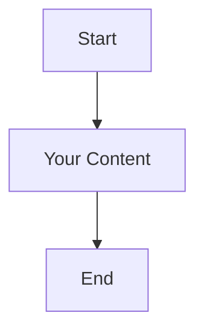

# Confluent Cloud Architecture Diagrams - Draw.io

This directory contains various architecture diagrams for the Confluent Cloud Terraform project.

## 📁 Available Diagrams

### 1. **ARCHITECTURE_DIAGRAMS.md** - Mermaid Diagrams
- Comprehensive set of Mermaid flowcharts showing:
  - Overall architecture overview (with sandbox environment)
  - Current deployment status (sandbox environment with 20 resources)
  - Terraform module structure (with disabled components noted)
  - Multi-environment resource flow (sandbox, dev, qa, uat, prod)
  - Resource naming conventions (using aws_topic_base_prefix)
  - Environment switching flow (including sandbox)
  - Data flow architecture (current sandbox deployment)
  - Connection endpoints and credentials
  - Next steps and recommendations

### 2. **confluent-architecture.drawio** - Draw.io Diagram (Create this file)
- Interactive Draw.io diagram
- Can be edited directly in VS Code with the Draw.io extension
- Good for detailed visual representations

## 🎨 How to Use These Diagrams

### **Mermaid Diagrams (ARCHITECTURE_DIAGRAMS.md)**
1. Open the file in VS Code
2. Use the Mermaid Chart extension to preview diagrams
3. Copy individual diagram code blocks to use elsewhere
4. Diagrams are automatically rendered in GitHub and many markdown viewers

### **Draw.io Diagrams**
1. Install the "Draw.io Integration" extension (already installed)
2. Create a new file with `.drawio` extension
3. VS Code will open the Draw.io editor
4. Create interactive, detailed architecture diagrams

## 🚀 Creating New Diagrams

### **To create a new Mermaid diagram:**

### **To create a new Draw.io diagram:**
1. Right-click in the architecture folder
2. Create new file with `.drawio` extension
3. VS Code will automatically open the Draw.io editor

## 🎯 Current Architecture Status

### ✅ **Currently Deployed (Sandbox Environment):**
- **Environment**: sandbox-env (env-7odpyp)
- **Kafka Cluster**: aws-sandbox-cluster (lkc-7jqzvp) - Basic tier
- **Region**: us-east-1
- **Topics**: 3 Kafka topics
- **Connectors**: 1 HTTP Source Connector (running)
- **Flink**: 1 Compute Pool (5 CFU) - available but no active statements
- **Service Accounts**: 2 (admin-manager, app-manager)
- **API Keys**: 3 (admin, admin kafka, app manager kafka)
- **ACLs**: 6 (service account and connector permissions)

### ❌ **Disabled Components:**
- **Schema Registry**: Not available in Basic cluster tier
- **Flink SQL Statements**: Commented out due to API key authorization issues
- **Multi-environment**: Currently single sandbox environment

### 🔧 **Configuration:**
- **Variable Prefix**: `aws_topic_base_prefix = "aws.myorg"`
- **Lifecycle Protection**: `prevent_destroy = false` (all resources)
- **Sub-environments**: `["sandbox"]`
- **Topic Partitions**: 3 (default)

## 📋 Diagram Types Available

### **Current Diagrams Show:**
- ✅ Overall system architecture
- ✅ Terraform module relationships
- ✅ Multi-environment resource distribution
- ✅ Data flow between components
- ✅ Deployment pipeline workflow
- ✅ Resource naming conventions
- ✅ Environment switching logic

### **Suggested Additional Diagrams:**
- Security architecture (IAM, ACLs, API keys)
- Network topology
- Data lineage
- CI/CD pipeline integration
- Monitoring and alerting architecture

---

*Architecture documentation for Confluent Cloud Terraform Multi-Environment Setup*
